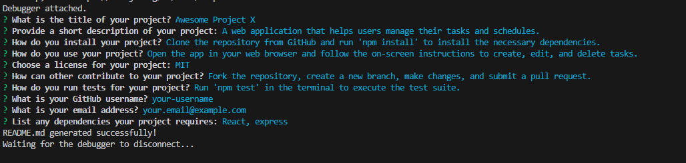
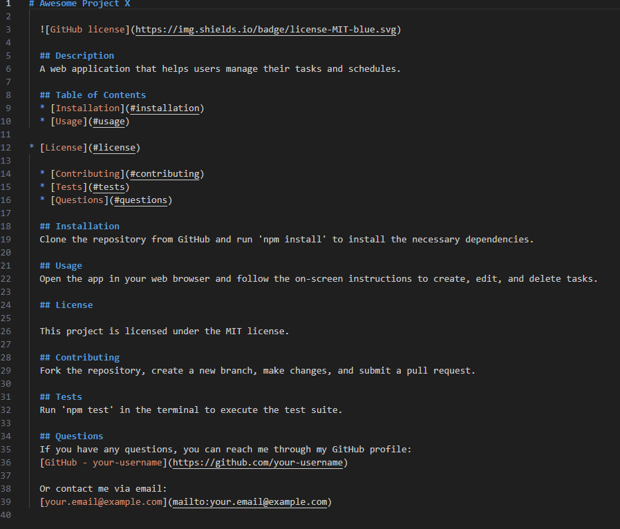

# README Generator Package
This new app to make README files will make your life so much easier! Just with a few clicks and questions answered, and you're on your way to a new generated README file!






## Introduction

In this application, you will find it with great ease how you can generate your own README file with just a few questions answered.

## Table of Contents
- [Installation](#installation)
- [Features](#features)
- [Usage](#usage)
- [License](#license)
- [Contributing](#contributing)
- [Tests](#tests)
- [Questions](#questions)


## Features

- **Questions:** There are questions here to help you know what you need to fill in for your README.

- **Customize:** Planning on having customized descriptions? This app can help you get a perfect README.


## Getting Started

To use ReadMe Generator Package:

1. Clone the repository:
   ```bash
   git clone https://https://github.com/PotionSela/ReadMe-Generator-Package

2. Open index.html in your preferred web browser.


## Usage

1. Configure the settings in the 'config.json' file
2. Run the application using the command: 'node index.js'


## Built With

- **JavaScript**


## Contributing
Contributions are welcome! If you find a bug or have a feature request, please open an issue.